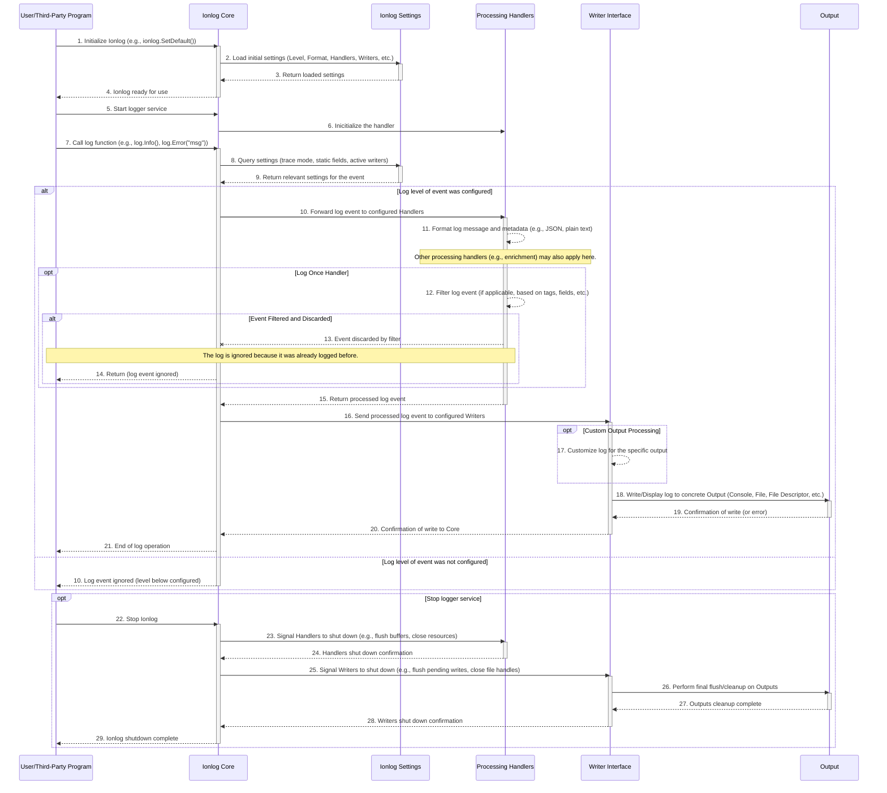

# ionlog

A flexible and structured logging library for Go with dynamic controls.

## Installation

```bash
go get github.com/IonicHealthUsa/ionlog
```

# Basic Usage
```go
package main

import "github.com/IonicHealthUsa/ionlog"

func main() {
    ionlog.SetLogAttributes(
        ionlog.WithTargets(ionlog.DefaultOutput), // Log to console
        ionlog.WithStaticFields(map[string]string{"service": "my-app"}),
        ionlog.WithLogFileRotation("logs", 10*ionlog.Mebibyte, ionlog.Daily),
    )

    ionlog.Start()
    defer ionlog.Stop()

    ionlog.Info("Application started")
}
```

# Advanced Usage
```go
package main

import (
	"github.com/IonicHealthUsa/ionlog"
)

func main() {
	// SetAttributes set the log attributes, and other configurations
	ionlog.SetAttributes(
		// WithWriters sets the write targets for the logger, every log will be written
		// to these targets.
		ionlog.WithWriters(
			ionlog.CustomOutput,
			// a websocket
			// a file
			// your custom writer
		),

		// (Optinal) WithoutTarget remove the writer targets for the logger. Pass the pointer of the writer.
		ionlog.WithoutWriters(
			// previously writer defined
		),

		// (Optional) WithStaticFields sets the static fields for the logger, every log will have these fields.
		ionlog.WithStaticFields(map[string]string{
			"computer-id": "1234",
			// your custom fields
		}),

		// (Optional) WithoutStaticFields remove the static fields for the logger. Use the key of the static field to remove.
		ionlog.WithoutStaticFields(
			// previously static field defined
		),

		// (Optional) WithLogFileRotation enables log file rotation, specifying the directory where log files will be stored, the maximum size of the log folder in bytes, and the rotation frequency.
		// This internal log rotation system appends the log file to the specified targets and automatically rotates logs based on the provided configuration,
		// ensuring the total size of the log folder does not exceed the specified maximum (e.g., 10MB in this case).
		ionlog.WithLogFileRotation("logs", 10*ionlog.Mebibyte, ionlog.Daily),

		// (Optional) WithQueueSize sets the size of the reports queue, which stores logs before sending them to a file descriptor. For default, the size of report is 100.
		ionlog.WithQueueSize(120),

		// (Optional) WithTraceMode enables trace log mode. For default, the trace mode is disable, to enable is need pass a tru boolean.
		ionlog.WithTraceMode(true),
	)

	// Start the logger service
	ionlog.Start()

	// Stops the logger service when the main function ends
	defer ionlog.Stop()

	// output: {"time":"2024-12-06T20:59:47.252944832-03:00","level":"INFO","msg":"This log level is: info","computer-id":"1234","package":"main","function":"main","file":"main.go","line":38}
	ionlog.Infof("This log level is: %v", "info")
	ionlog.Errorf("This log level is: %v", "error")
	ionlog.Warnf("This log level is: %v", "warn")
	ionlog.Debugf("This log level is: %v", "debug")
	ionlog.Tracef("This log level is: %v", "trace")

	ionlog.Info("This log level is a simple info log")
	ionlog.Error("This log level is a simple error log")
	ionlog.Warn("This log level is a simple warn log")
	ionlog.Debug("This log level is a simple debug log")
	ionlog.Trace("This log level is a simple trace log")

	status := "NOT OK"
	for i := range 10 {
		ionlog.LogOnceInfo("Process Started!") // This will be logged only once
		ionlog.LogOnceDebugf("count: %v", i)   // Log every time i changes
		if i == 5 {
			status = "OK"
		}
		ionlog.LogOnceInfof("status: %v", status) // Log once "NOT OK", log once "OK"
	}
}
```

# Key Features
## Configuration Options

### Targets: Log to multiple destinations (console, files, websockets, custom writers).
```go
ionlog.WithTargets(ionlog.DefaultOutput, myCustomWriter)
```

### Targets: Remove the target.
```go
ionlog.WithoutTargets(ionlog.DefaultOutput, myCustomWriter)
```

### Static Fields: Add fixed fields to all logs (e.g., service name, environment).
```go
ionlog.WithStaticFields(map[string]string{"env": "production"})
```

### Static Fields: Remove the static fields.
```go
ionlog.WithStaticFields("env")
```

### Log Rotation: Auto-rotate logs by size and time.
```go
ionlog.WithLogFileRotation("logs", 100*ionlog.Mebibyte, ionlog.Hourly)
```

### Report Size: sets the size pf reports queue.
```go
ionlog.WithQueueSize(200)
```

### Trace: enable or disable the trace mode.
```go
ionlog.WithTraceMode(true)
```

## Logging Functions
- Levels: Debug, Info, Warn, Error.
```go
ionlog.Infof("User %s logged in", "Alice")
ionlog.Error("Connection failed")
```

- The trace level is optional. It is necessary to enable.
```go
ionlog.Trace("Trace the path")
```

## Structured Output: Logs are emitted as JSON with metadata:
```json
{
	"time":"2024-12-06T20:59:47.252944832-03:00",
	"level":"INFO",
	"msg": "User Alice logged in",
	"service-id":"0xcafe",
	"package":"main",
	"function":"main",
	"file":"main.go",
	"line":42
}
```

## Special Logging

### Log Once: Write a message only once during execution.
```go
ionlog.LogOnceInfo("Initialization complete")
```

### Log on Change: Only log when the value changes.
```go
status := "STARTING"
ionlog.LogOnceInfof("status: %s", status) // Logs once
ionlog.LogOnceInfof("status: %s", status) // Will not log

status = "RUNNING"
ionlog.LogOnceInfof("status: %s", status) // Logs again
ionlog.LogOnceInfof("status: %s", status) // Will not log
```

## Lifecycle Management:

- Start() initializes the logger
```go
ionlog.Start()
```

- Stop() closes the logger when the program ends
```go
ionlog.Stop()
```


# Internal Logging system:
- Internal logs are handled by the slog package, and outputed to the os.Stdout by default.


# Process Flow Diagram

